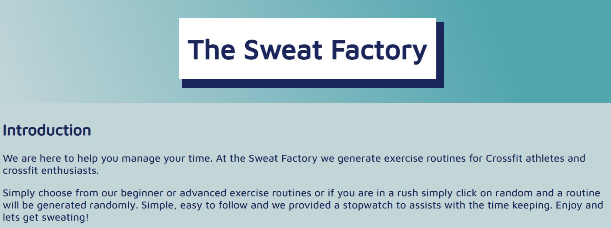

# The Sweat Factory

[Live Site](https://louwjohan.github.io/the-sweat-factory/)

[Github Repository](https://github.com/louwJohan/the-sweat-factory)

## About

Staying fit and healthy make you better at life. You sleep better your mood is improved, you are more productive at work and the list goes on. Getting started with workout routines can be very intimidating and working out what to do can sometimes make you feel lost. 

We created The Sweat Factory to help with exercise routines. Mixing things up and and keeping it simple. From the diehard Crossfit Athletes to total beginners and everyone that wants to get fit and healthy. We supply the routines you supply the sweat.

## User Stories

Starting a exercise routine can be daunting. What do you start with, how long must I do it etc, etc. We created The Sweat Factory to take care of all you routines. We have a lot of decisions to make every day and The Sweat Factory is here to help. 

### Who will visit the site?

1. The site caters for Crossfit Athletes that want a good workout. 
2. Beginners who don't know where to start.
3. Anyone who want to get into functional fitness this a good place to start.

## Features

The website is easy to navigate and to understand. It features one page with a header and a short introduction. There are three slides with links to the various levels and also a random link if you cant decide.

It has a stopwatch for you exercise below the list. There are also links to our various social media platforms if you want demo's of the various movements or if you want to connect to the community.

## Header and Intro

The header has the websites name in a bos clearly displayed and below it is a short introduction of why you would use the site.

## Slides

The slides contain three links. this helps with navigating on the page and displays a list of exercises. The Beginner button will display a list of beginner exercises.

 Advanced will display an advanced list.
  
 
 If you cannot choose from the list, there is a random link. It will ask you what level you are at(Beginner or Advanced), and when you click on the level it will assign you an exercise at your chosen level.

## Exercise List and Stopwatch

Once you have chosen or been assigned at random the exercise list will appear.
It is displayed in a list where the first exercise appears at the top. Some of the routines have a time limit and others are for time(how fast can you perform the routine) We provided a stopwatch to keep time. It was placed under the list so you can keep track of the time and what exercise to perform next

## Footer 

The footer contains links to our social media pages for people to connect and for demo's of our exercises.

## Technologies Used

1. HTML
2. CSS
3. Javascript

## Testing

1. HTML - The HTML was passed through [HTML Validator](https://validator.w3.org/) and no errors were found.
2. CSS - The CSS was passed through [Jigsaw](http://jigsaw.w3.org/css-validator/validator) no errors were found but displayed warnings.
3. Javascript - was passed through [JSLint](https://www.jslint.com/) warnings were displayed lins of code in the lists are longer than 80 characters
4. When first testing the website the stopwatch had a bug. When the start button was pressed the stopwatch started and when pressed again it would start again . I changed the code to add a "pass" if the values of the minutes or seconds were greater than zero.
5. The website was tested on and Iphone SE , 8 ,with Google Chrome , Microsoft Edge, Firefox, Safari and on an Ipad. The website worked as expected.
6. The links was tested on every button and the stopwatch was run to make sure it displays the correct time. The exercises work on "For time ", how fast the exercise can be performed or a time limit eg. 20 min , so there was no need for hour on the stopwatch.
7. When testing the hover effect on the slide links the text would not change unless you hovered over the text. I added a anchor element inside a button. It was fixed by removing the button element in the HTML. 

## Accessibility 

## Unfixed Bugs

There are no unfixed bugs

## Deployment

Regular commits was made to save progress. When changes was made we typed in the following in bash the terminal
1. git add . (adds all the changes)
2. git commit -m "commit message" (commits the changes with a message)
3. git push (pushes the changes to Github)

Github pages was used to deploy page. 
1. Log onto Github and go to repository.
2. In the repository scroll down to the Github pages section. 
3. Select the main branch from the dropdown menu and select the root directory and save

## Credits

### Content
- Stopwatch code was developed with the help of a youtube video  by Gowtham Tirri.

### Media 
- Photos were taken from Pexels.com

